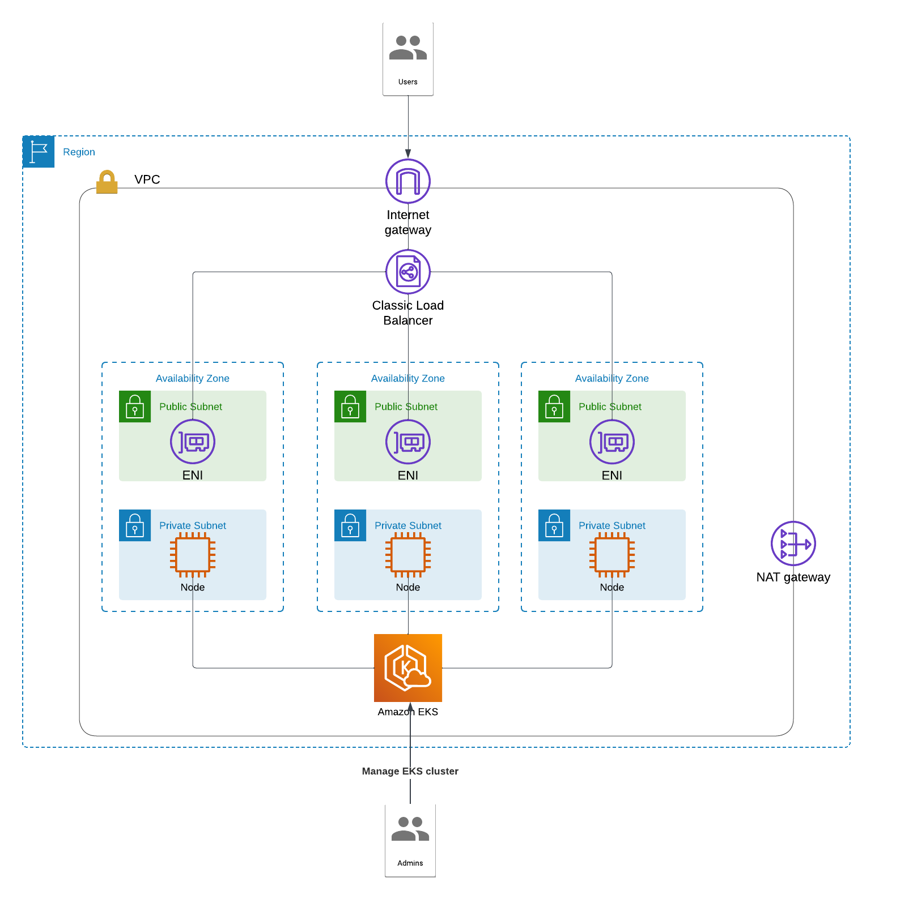

# Terraform AWS

The goal of this project is to deploy an AWS EKS cluster and deploy the jfrog-platform helm chart using terraform.

## Pre-requisites

- An AWS account
- AWS CLI configured with all required access
- Terraform v1.9.8 or earlier
- Kubernetes command line tool (kubectl) 
- Helm CLI

## Usage

Before applying the stack, you must set up configuration files :

- copy and edit ```example.tfvars``` to suit your environment. This filename must be ```terraform.tfvars```

    
    cp example.tfvars ./terraform.tfvars

- edit the ```values.yaml``` to suit your need
- edit the ```backend.tf``` to suit your need. You can use JFrog [Terraform backend repository](https://jfrog.com/help/r/jfrog-artifactory-documentation/terraform-backend-repository) as a dedicated Remote Storage Provider. 
- edit the ```providers.tf``` to suit your need


Terraform apply command:

    terraform init
    terraform apply

You can apply a specific terraform modules as follows:

    terraform apply --target=module.aws-infra
    terraform apply --target=module.helm


To destroy all resources, apply the following command:

    terraform destroy


## Modules

### aws-infra

This module deploy the AWS infrastructure including:

- AWS VPC with 3 public subnet and 3 private subnet
- Nat Gateway
- EKS cluster with EC2 nodes



Once you deployed the module, you can update your Kubeconfig using the following command:

    aws eks update-kubeconfig --name <CLUSTER_NAME> --region <REGION>

### helm

This module deploy a giving helm-chart to the EKS cluster. To apply specific configuration to the JFrog platform, you must edit the ```values.yaml``` to suit your need.

[here](https://github.com/jfrog/charts/blob/master/stable/jfrog-platform/values.yaml) is an example of values.yaml for the jfrog-platform hemlm chart.


<!-- BEGIN_TF_DOCS -->
## Requirements

| Name | Version |
|------|---------|
| <a name="requirement_aws"></a> [aws](#requirement\_aws) | 5.79.0 |

## Providers

No providers.

## Modules

| Name | Source | Version |
|------|--------|---------|
| <a name="module_aws-infra"></a> [aws-infra](#module\_aws-infra) | ./modules/aws | n/a |
| <a name="module_helm"></a> [helm](#module\_helm) | ./modules/helm | n/a |

## Resources

No resources.

## Inputs

| Name | Description | Type | Default | Required |
|------|-------------|------|---------|:--------:|
| <a name="input_chart_name"></a> [chart\_name](#input\_chart\_name) | Chart name to install | `string` | n/a | yes |
| <a name="input_cluster_endpoint_public_access"></a> [cluster\_endpoint\_public\_access](#input\_cluster\_endpoint\_public\_access) | Indicatr whether or not the AWS EKS public API server endpoint is enabled | `bool` | `true` | no |
| <a name="input_namespace"></a> [namespace](#input\_namespace) | The namespace to install the release into | `string` | `"default"` | no |
| <a name="input_private_subnets"></a> [private\_subnets](#input\_private\_subnets) | Private subnets CIDR blocks | `list(string)` | n/a | yes |
| <a name="input_project_name"></a> [project\_name](#input\_project\_name) | Project name | `string` | n/a | yes |
| <a name="input_public_subnets"></a> [public\_subnets](#input\_public\_subnets) | Public subnets CIDR blocks | `list(string)` | n/a | yes |
| <a name="input_release_name"></a> [release\_name](#input\_release\_name) | Release name | `string` | n/a | yes |
| <a name="input_repository"></a> [repository](#input\_repository) | Repository URL where to locate the requested chart | `string` | n/a | yes |
| <a name="input_vpc_azs"></a> [vpc\_azs](#input\_vpc\_azs) | Availability zones | `list(string)` | n/a | yes |
| <a name="input_vpc_cidr"></a> [vpc\_cidr](#input\_vpc\_cidr) | VPC CIDR block | `string` | n/a | yes |
| <a name="input_workers_desired_size"></a> [workers\_desired\_size](#input\_workers\_desired\_size) | EKS managed node group desired size | `number` | n/a | yes |
| <a name="input_workers_instance_types"></a> [workers\_instance\_types](#input\_workers\_instance\_types) | EKS managed nodes instance types | `list(string)` | n/a | yes |
| <a name="input_workers_max_size"></a> [workers\_max\_size](#input\_workers\_max\_size) | EKS managed node group max size | `number` | n/a | yes |
| <a name="input_workers_min_size"></a> [workers\_min\_size](#input\_workers\_min\_size) | EKS managed node group min size | `number` | n/a | yes |

## Outputs

No outputs.
<!-- END_TF_DOCS -->